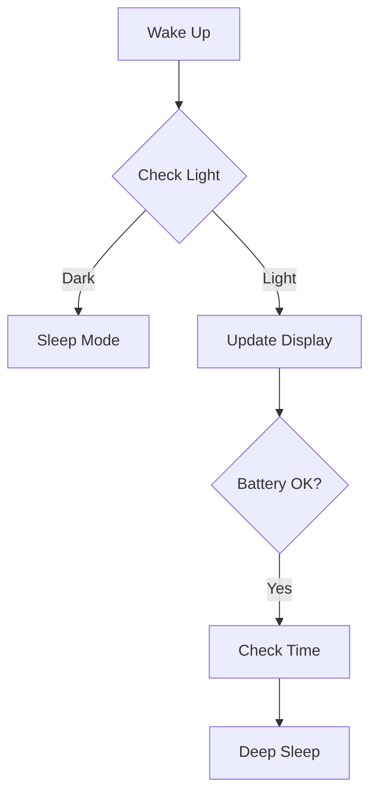

<div align="center">
  <h1>🌟 Minimalistic E-Paper NTP-RTC Clock 🕒</h1>
  <p>
    
    
    
    
  </p>
</div>

<details>
<summary>📊 System Specifications</summary>

```ini
Microcontroller: Xiao ESP32 C3
Display: 3.52" BiColor E-paper (360x240)
Battery: LiFePO4 6000mAh 3.2V
Operating Voltage: 3.2V
Sleep Duration: 60 seconds
I2C Speed: 400kHz
Battery Thresholds:
  - Upper Limit: 3.3V
  - High: 3.4V
  - Low: 2.9V
NTP Server: asia.pool.ntp.org
Time Offset: 19800 (India)
```
</details>

## 🛠️ Hardware Components
<table>
<tr>
  <th>Component</th>
  <th>Specifications</th>
  <th>Details</th>
</tr>
<tr>
  <td><br>Xiao ESP32 C3</td>
  <td>
    • MCU: ESP32-C3<br>
    • Clock: 400kHz I2C<br>
    • Mode: Deep Sleep Enabled
  </td>
  <td>Main controller with WiFi</td>
</tr>
// ... Add similar rows for other components ...
</table>

## 💡 Key Features
<div align="center">
  <table>
    <tr>
      <td align="center">⚡<br>Power Efficient</td>
      <td align="center">🌙<br>Night Mode</td>
      <td align="center">🔄<br>Auto Update</td>
      <td align="center">📊<br>Battery Monitor</td>
    </tr>
    <tr>
      <td>60s Deep Sleep</td>
      <td>Light Sensor Based</td>
      <td>Daily NTP Sync</td>
      <td>Voltage Tracking</td>
    </tr>
  </table>
</div>

## 📈 System Architecture


## 🚀 Quick Start
<details>
<summary>Prerequisites</summary>

```yaml
Required Libraries:
  - SPI
  - Wire (I2C @ 400kHz)
  - WiFi
  - NTPClient
  - Preferences
  - BH1750 (0x23)
  - RTClib
```
</details>

<details>
<summary>Installation Steps</summary>

1. Clone repository
2. Configure WiFi:
```cpp
const char *ssid = "Your_SSID";
const char *password = "Your_PASSWORD";
```
3. Update pins in `src/epdif.h`
4. Upload code
</details>

## 📊 Power Analysis
<table>
<tr>
  <th>Mode</th>
  <th>Duration</th>
  <th>Current Draw</th>
</tr>
<tr>
  <td>Deep Sleep</td>
  <td>60 seconds</td>
  <td>~10µA</td>
</tr>
// ... Add other power states ...
</table>

## 🔋 Battery Performance
```
Initial: 06/06/2024
Final: 01/11/2024
Runtime: ~4 months 27 days
```

## 📷 Gallery
<div align="center">

</div>

<details>
<summary>📝 Technical Notes</summary>

- ADC Pin for Battery: A0
- Battery Sampling: 4 readings average
- Light Sensor: BH1750 (0x23)
- WiFi Mode: STA
- Display Library: OEM Basic (No GxEPD2)
</details>

---
<div align="center">
<p>Made with ❤️ and ♻️ materials</p>
<p>📜 <i>Distribute freely with attribution</i></p>
</div>

